# Hemavision

Sistem skrining anemia non-invasif berbasis citra, dikembangkan untuk tiga situs anatomis: konjungtiva (mata), telapak tangan (palm), dan kuku (nail). Setiap situs punya pipeline akuisisi dan segmentasi sendiri, tetapi bermuara pada arsitektur ekstraksi fitur dan model prediksi multi-task yang sama, menghasilkan estimasi kadar hemoglobin (g/dL), status anemia, dan tingkat keparahan (severity) dari satu foto atau video.

## Arsitektur Umum

Proyek disusun dengan arsitektur multi-situs, sehingga pengembangan satu situs terpisah dari situs lain namun berbagi komponen inti yang sama:

- `src/common/`: quality control, normalisasi iluminasi (CLAHE), ekstraksi fitur dual-path, model multi-task, dan metrik evaluasi, dipakai lintas ketiga situs.
- `src/sites/<situs>/`: kode khusus satu situs, seperti loader dataset, segmentasi ROI, dan pemilihan frame.
- `notebooks/<situs>/`: notebook driver per stage (harmonisasi data, segmentasi, quality control, ekstraksi fitur, training, evaluasi, report assets).
- `configs/`, `dataset/<situs>/`, `outputs/<situs>/`, `artifacts/<situs>/`: resolusi path, data mentah, hasil, dan checkpoint model, masing-masing bernamespace per situs.

Setiap pipeline situs mengikuti alur yang sama secara konseptual:

1. **Segmentasi ROI** dari citra mentah, memisahkan region of interest (jaringan konjungtiva, telapak tangan, atau lempeng kuku) dari latar belakang.
2. **Quality control**, menolak sampel dengan ROI terlalu kecil atau kualitas citra tidak memadai.
3. **Normalisasi iluminasi** (CLAHE pada kanal V) agar warna kulit/jaringan konsisten lintas kondisi pencahayaan.
4. **Ekstraksi fitur dual-path**: fitur warna/tekstur hand-crafted (27 fitur berbasis RGB, HSV, CIELAB, tekstur, entropi) dan embedding deep (ResNet18), digabung lewat fusion vector bersama variabel demografi (usia, gender) dan site token.
5. **Model prediksi multi-task** (`HemavisionModel`), memprediksi kadar hemoglobin (regresi), status anemia (klasifikasi biner), dan severity (klasifikasi ordinal) sekaligus dari satu fusion vector.

## Situs 1: Konjungtiva

Dataset: CP-AnemiC dan Eyes-Defy. Input berupa satu foto mata mentah.

Pipeline: segmentasi U-Net memisahkan konjungtiva palpebral dari bagian mata lain, dilanjutkan quality control (blur, brightness, glare, ukuran ROI), normalisasi CLAHE, ekstraksi fitur dual-path (hand-crafted plus embedding ResNet18), lalu prediksi multi-task menghasilkan estimasi hemoglobin, status anemia, dan severity. Heatmap biomarker warna dihitung dari kanal a* CIELAB (derajat kemerahan).

| Raw Photo | Segmentation | CLAHE Normalization | Biomarker Heatmap |
|---|---|---|---|
| 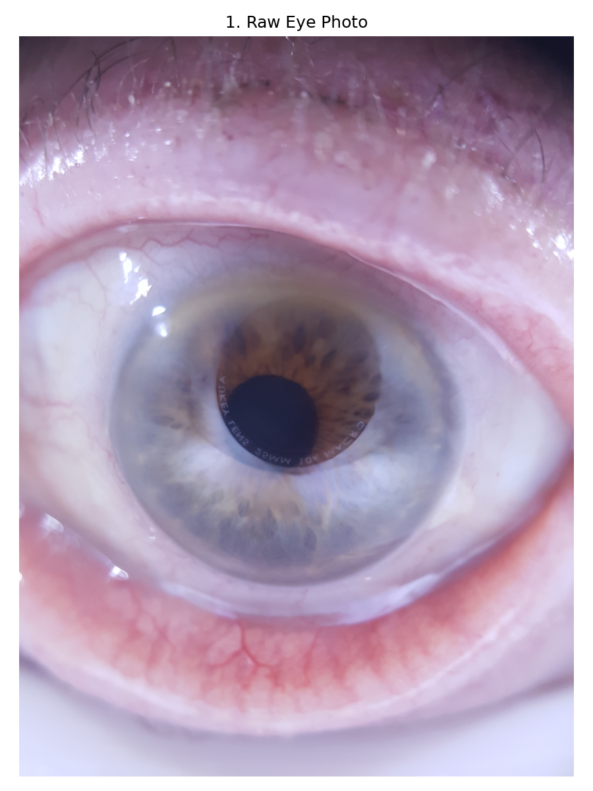 | 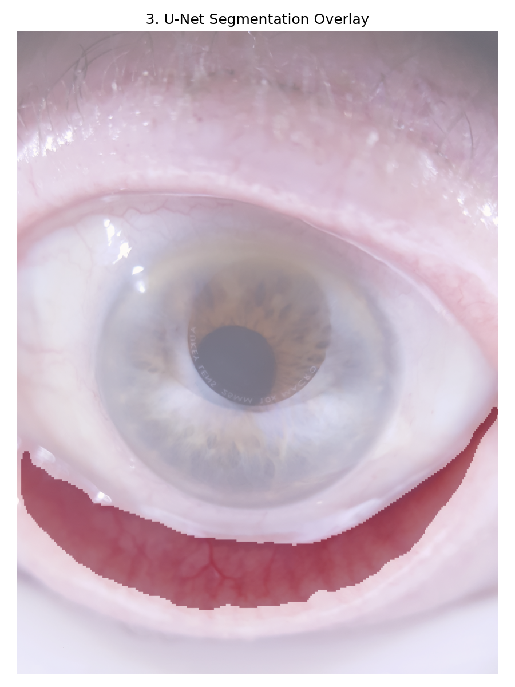 | 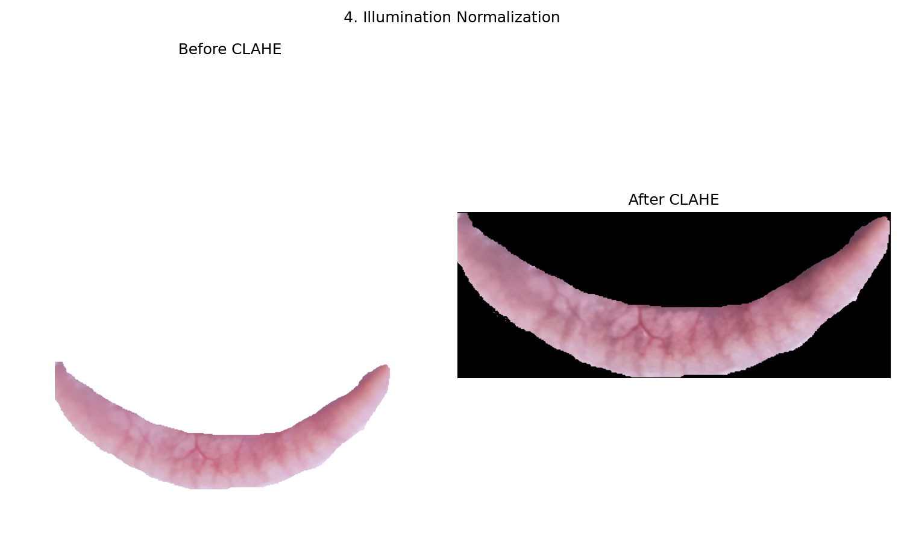 | 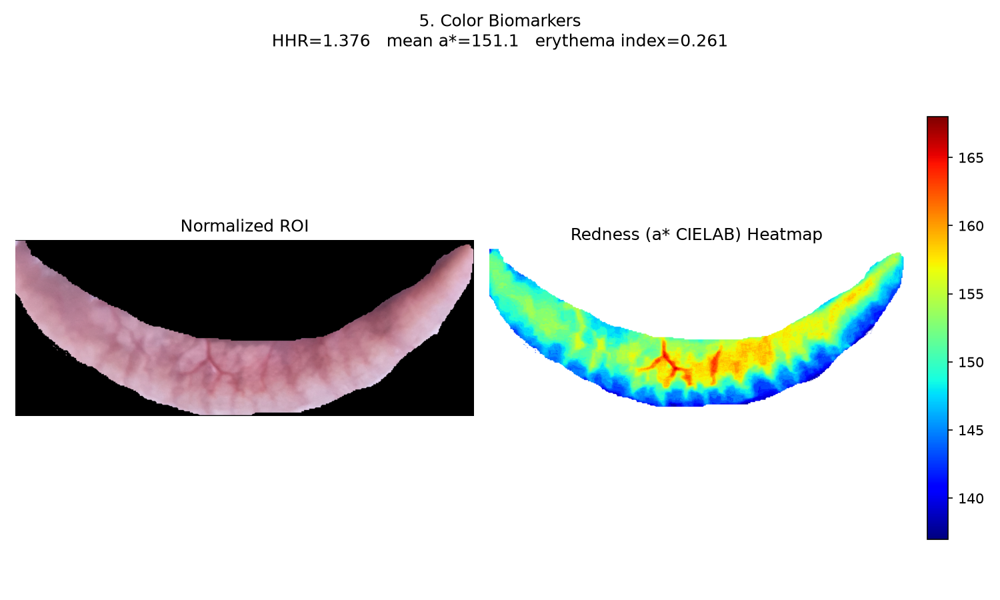 |

## Situs 2: Palm

Dataset video telapak tangan. Input berupa satu video mentah.

Pipeline: pemilihan frame terbaik dari seluruh video lewat deteksi landmark tangan (MediaPipe Hands), dengan fallback segmentasi warna kulit bila landmark gagal terdeteksi. ROI telapak tangan diekstrak dari frame terpilih, dilanjutkan quality control (ukuran ROI), normalisasi CLAHE, ekstraksi fitur dual-path, lalu prediksi multi-task. Heatmap biomarker warna dihitung dari erythema index (log rasio kanal hijau).

| Raw Frame | Landmark Detection | ROI Segmentation | Illumination Normalization | Biomarker Heatmap |
|---|---|---|---|---|
| 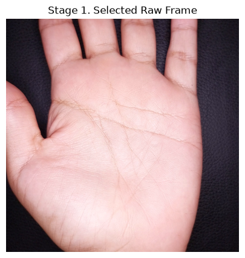 | 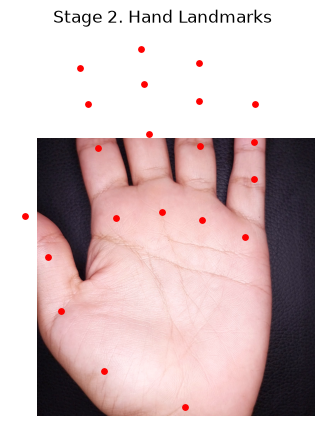 | 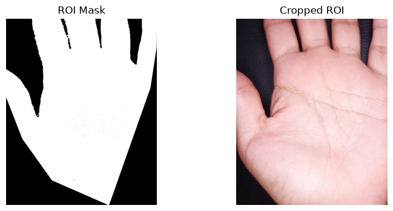 | 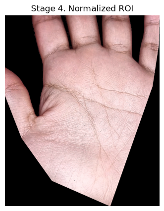 | 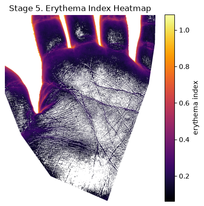 |

## Situs 3: Nail

Dataset Valles-Coral. Input berupa satu foto jari mentah.

Pipeline: segmentasi jari dan lempeng kuku murni geometris (thresholding warna kulit YCbCr dan heuristik posisi ujung jari), tanpa model segmentasi maupun landmark. ROI kuku diekstrak, dilanjutkan quality control (ukuran ROI), normalisasi CLAHE, ekstraksi fitur dual-path, lalu prediksi multi-task. Model produksi nail memakai jalur embedding deep saja (tanpa fitur hand-crafted sebagai input model, fitur tersebut tetap dihitung untuk keperluan tampilan). Heatmap biomarker warna dihitung dari erythema index, sama seperti palm.

| Raw Photo | Finger and Nail Segmentation | Cropped and Normalized ROI | Biomarker Heatmap |
|---|---|---|---|
| 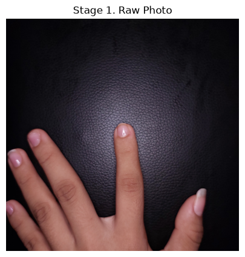 | 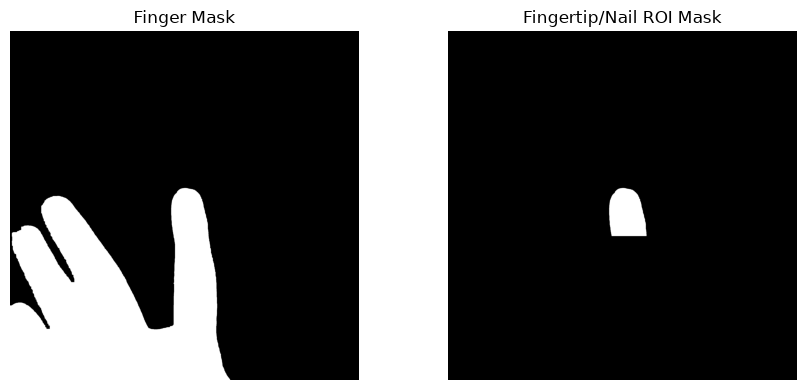 | 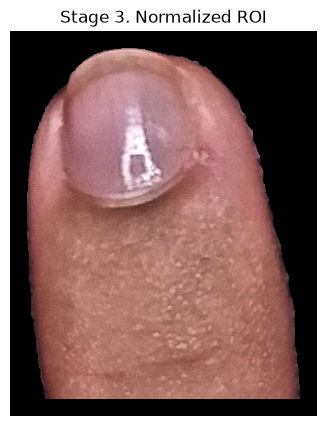 | 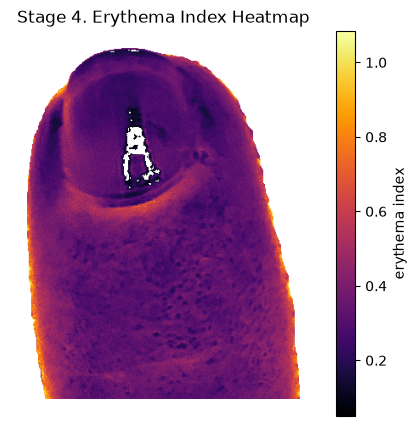 |
