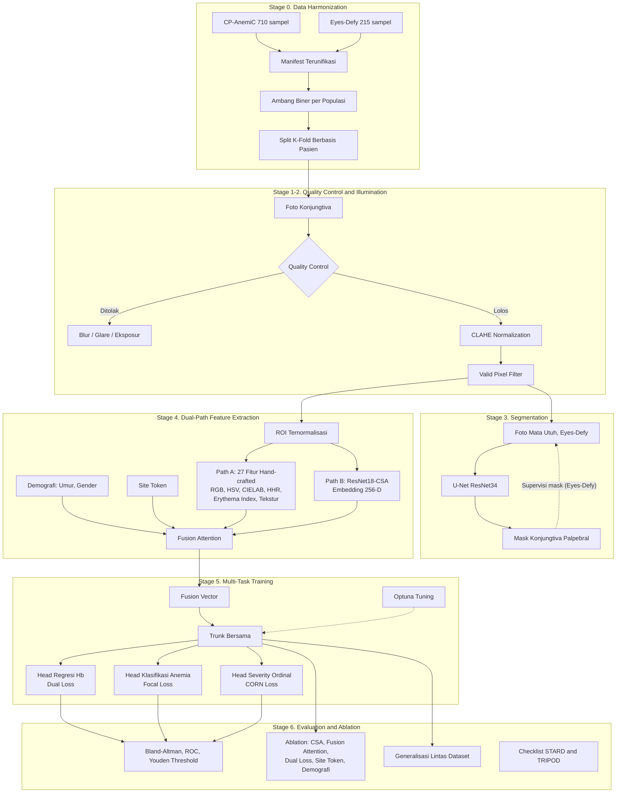

# Pipeline Diagram: Conjunctiva Site

Diagram mermaid berikut merangkum pipeline konjungtiva secara menyeluruh, dari data mentah hingga evaluasi. Siap ditempel ke proposal atau dirender menjadi gambar lewat editor mermaid.

## Ringkasan Alur Utama

Data dari dua dataset publik disatukan dan dibagi berbasis pasien (Stage 0), lalu setiap citra melewati gerbang kualitas dan normalisasi pencahayaan (Stage 1-2). Segmentasi U-Net menjembatani foto mata utuh menuju region of interest (Stage 3). Dua jalur fitur komplementer, hand-crafted dan deep embedding, difusikan bersama demografi dan site token (Stage 4), lalu dilatih multi-task dengan tiga head yang dituning lewat Optuna (Stage 5). Model diuji klinis mendalam, diverifikasi lewat ablation, dan diukur generalisasinya lintas populasi (Stage 6).
