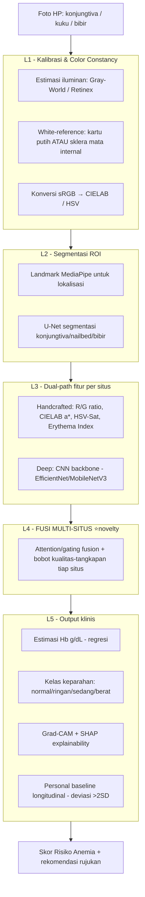
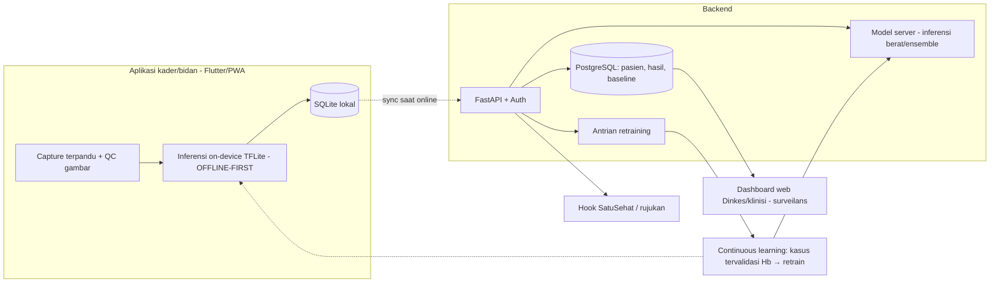
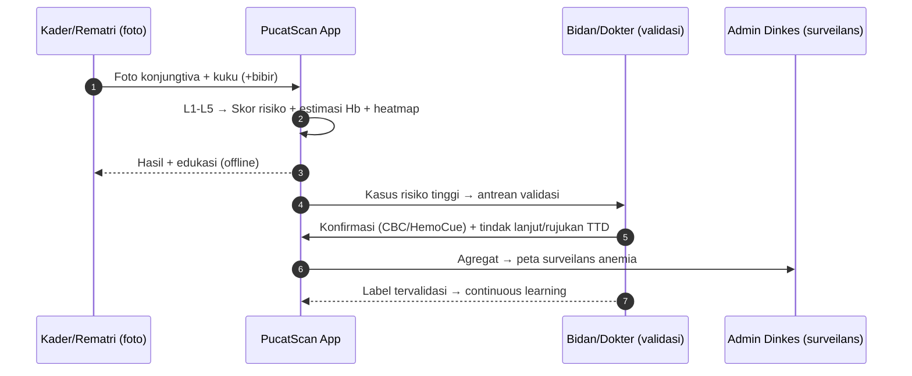
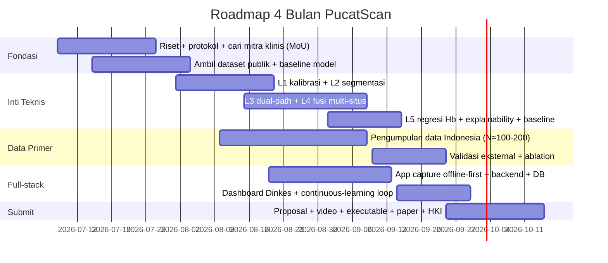

# STRATEGI GEMASTIK 2026 — Divisi PPL
## Aplikasi Skrining Anemia Non-Invasif Multi-Situs (Konjungtiva + Kuku + Bibir)

> Dokumen strategi utama tim. Disusun dari: draf FPS, benchmark juara 1 2025 (TB Vector), panduan resmi Divisi PPL (hlm. 62–65), rubrik 10 pola juara, dan riset dataset/kompetisi (Jul 2026).
>
> **Nama kerja:** **PucatScan** — *"Anemia terlihat, sebelum berbahaya."*
> (Alternatif nama: HemaLens / CekPucat / PallorFuse — bisa difinalkan nanti. "Pucat" dipilih karena itu **tanda klinis anemia yang dikenal awam** dan langsung memori-able seperti "TB Vector".)

---

## 0. Keputusan yang sudah dikunci (basis dokumen ini)

| Keputusan | Pilihan | Alasan singkat |
|---|---|---|
| Divisi | **PPL (Pengembangan Perangkat Lunak)** | Deliverable = software (executable/URL, mockup UI). Alat ESP32 = divisi IoT. TB Vector menang di PPL sebagai *sistem software*. |
| Bentuk produk | **Aplikasi smartphone/web + AI** (tanpa hardware custom) | Fit divisi + realistis 4 bulan + beda tegas dari alat FPS. |
| Situs pallor | **Konjungtiva + kuku (inti)** · **bibir (kontribusi novel, opsional)** | Konjungtiva & kuku punya dataset publik berlabel Hb; bibir = gap riset (butuh data primer). |
| Data | **Dataset publik (MVP) + data primer Indonesia (validasi)** | Ada akses klinis tim → booster deployment proof & impact. |

**Pergeseran dari draf FPS** (penting dipahami tim):
- ❌ **Buang** konsep alat HEMOFINGER (ESP32/LED/thermistor/Peltier) → salah divisi + risiko manufaktur.
- ❌ **Buang** premis CRT/perfusion index → referensi FPS sendiri (Pickard 2011) menyebut CRT *"unreliable predictor"*; juri medis akan menangkap kontradiksi ini.
- ✅ **Pertahankan** ide bagus FPS: fusi multi-parameter, *personal baseline* longitudinal, SHAP explainability, positioning "skrining bukan diagnosis", model ekonomi kesehatan, business model.
- 🔁 **Ganti sinyal**: dari "konsekuensi fisiologis" (CRT/PI) → **pallor optik langsung** (konjungtiva/kuku/bibir) yang berbasis bukti kuat & punya dataset.

---

## 1. Problem framing (kriteria C1–C2)

**Pola juara: angka hyper-spesifik + kaitkan target nasional.** Anemia unggul di sini.

### Angka kunci Indonesia
- **~70 juta** penduduk terdampak anemia (25–30% populasi target).
- Ibu hamil **~27,7%** anemia → kontributor **kematian ibu** & **berat badan lahir rendah**.
- Remaja putri **~30%** anemia → cikal-bakal **anemia maternal** & **stunting** generasi berikutnya.
- Balita 6–59 bln **~38%** → gangguan perkembangan kognitif.

### The fatal gap = **deteksi**, bukan kesadaran/obat
Tablet Tambah Darah (TTD) murah & tersedia; masalahnya **tidak ada cara mengukur siapa yang anemia secara massal & murah**. CBC butuh vena+lab; HemoCue butuh **lancet + strip Rp 50–100rb/tes + limbah biohazard** → mustahil untuk skrining massal di 300rb+ Posyandu.

### Kaitan target nasional (C2 — sangat kuat)
- **Asta Cita** (prioritas Presiden): kesehatan & SDM unggul.
- **SDG 3** (Good Health) — tema GEMASTIK 2026 merujuk Asta Cita/SDGs.
- **Rantai anemia rematri → stunting**: program TTD nasional butuh alat *monitoring* efektivitas → PucatScan = triase & pemantauan program TTD di sekolah/Posyandu.

> **Kalimat pembuka pitch (draf):** *"Setiap jam, Indonesia kehilangan produktivitas dan masa depan generasi karena 70 juta orang anemia — bukan karena tak ada obat, tapi karena tak ada cara murah untuk melihat siapa yang anemia. Kami buat anemia terlihat, dari satu foto."*

---

## 2. Solusi inti & kedalaman teknis (C3–C4)

**Prinsip:** hindari "foto → CNN → label" (1 lapisan = terbaca notebook Kaggle). Kita bangun **pipeline berlapis dengan justifikasi color/imaging science** — inilah "fisika" versi kita (analog DSP-nya TB Vector).

### 2.1 Pipeline AI (5 lapisan)

### 2.2 Justifikasi domain tiap lapisan (untuk C4 — WAJIB muncul di proposal/paper)

| Lapis | Kenapa (sains) |
|---|---|
| **L1** | Kamera HP *device-dependent* & sensitif iluminasi. Ini **penyebab utama app nyata gagal**: validasi klinis eMoglobin (PLOS One 2024) sensitivitas hanya **54%** di dunia nyata justru karena variasi ini. Menyelesaikan L1 = **kontribusi headline** kita. |
| **L2** | Pallor harus diukur di ROI konsisten; Eyes-Defy-Anemia sudah sediakan mask konjungtiva sebagai supervisi. |
| **L3** | **Hemoglobin menyerap cahaya hijau/biru & memantulkan merah** → makin sedikit Hb, warna bergeser ke hijau-biru. Maka R/G ratio, CIELAB a\* (redness), Erythema Index adalah **kuantifikasi pallor berbasis optik**, bukan fitur asal. Dual-path = analog "MFCC (handcrafted) + LSTM (deep)". |
| **L4** | Tiap situs punya kelebihan (konjungtiva paling banyak data; kuku mudah difoto; bibir mukosa lembab). **Fusi = redundansi → robust** saat 1 situs berkualitas buruk. |
| **L5** | Positioning **skrining, bukan diagnosis**; explainability & baseline = maturity klinis. |

### 2.3 Isu fairness/melanin = daging teknis + diferensiasi etika
Warna kulit Indonesia beragam; dataset publik bias etnis (CP-AnemiC = Ghana; MSU = tanpa kulit sangat gelap). **Modul normalisasi robust-skin-tone + validasi lintas skin-tone** = sekaligus (a) lapisan teknis, (b) keunggulan etika/fairness, (c) novelty. Wajib dibahas eksplisit di limitasi + solusi.

---

## 3. Arsitektur software full-stack (C5–C6)

**Prinsip benchmark: "kelengkapan > kompleksitas".** Bukan Kafka/K8s — tapi lengkap & rapi, offline-first.

- **Frontend capture**: Flutter/PWA, **offline-first** (Posyandu tanpa sinyal) + panduan pose + **quality-check** (tolak foto blur/gelap).
- **On-device TFLite**: hasil instan tanpa internet; sinkron saat online.
- **Backend**: FastAPI (natural untuk ML) + PostgreSQL + Docker.
- **Dashboard**: surveilans anemia regional untuk Dinkes.
- **Continuous learning (C7)**: kasus yang divalidasi CBC/HemoCue → antrian retraining berkala.
- **Skalabilitas**: dijual lewat arsitektur offline-first + sync + dashboard nasional + hook SatuSehat — *bukan* infra raksasa.

---

## 4. Multi-role workflow (C8)

Tiga peran eksplisit = sinyal maturity (persis pola TB Vector: dokter/perawat/IT).

---

## 5. Data strategy

### 5.1 Dataset publik (untuk MVP — de-risked)
| Dataset | Situs | #Gambar | Label Hb | Akses |
|---|---|---|---|---|
| CP-AnemiC (Ghana) | Konjungtiva | 710 | ✅ g/dL | Mendeley (publik) |
| Eyes-Defy-Anemia | Konjungtiva + mask | 218 | ✅ Hb | IEEE DataPort / Kaggle |
| Appiahene conjunctiva | Konjungtiva | — | ✅ | Mendeley |
| MSU photo-haemoglobin | Kulit + kuku | 250 | ✅ g/L | figshare + GitHub |
| Ghana fingernail | Kuku | 710 (→4.260 aug) | ✅ | Mendeley |
| *(Bibir Türkiye)* | Bibir | 138 | ⚠️ biner, *on-request* | tidak ter-deposit |

### 5.2 Data primer Indonesia (pakai akses klinis tim) — pembeda utama
- **Protokol**: foto 3 situs + **HemoCue/CBC same-day sebagai ground truth**, di Posyandu/sekolah/Puskesmas mitra.
- **Target realistis**: mulai N≈100–200 (stratifikasi normal/ringan/sedang/berat), lintas skin-tone.
- **Nilai jual**: (a) validasi di populasi Indonesia (bukan cuma dataset Afrika/Rusia); (b) **satu-satunya dataset yang mencakup konjungtiva+kuku+bibir pada pasien sama** → aset novel + potensi paper/HKI.
- **Etik**: informed consent, "skrining bukan diagnosis", data biometrik tidak disimpan mentah (hanya fitur/ROI ter-anonim), benefit-sharing (peserta dapat skrining + rujukan gratis).

---

## 6. Novelty & diferensiasi (kritis: juri 2026 waspada karya derivatif TB Vector)

| Dimensi | TB Vector 2025 | PucatScan 2026 |
|---|---|---|
| Sinyal | Audio (batuk) | **Citra pallor multi-situs** |
| Penyakit | Infeksi menular akut | **Kronis/gizi (anemia)** |
| Deployment | Mic array ruang publik | **HP personal, offline-first** |
| Output | Klasifikasi event | **Estimasi Hb + severity + baseline longitudinal** |

**Novelty asli terkonfirmasi riset:** fusi **konjungtiva+kuku+bibir belum pernah dilakukan** & tak ada dataset publik yang mencakup ketiganya. Diferensiasi vs app komersial (Sanguina AnemoCheck app = single-site kuku, tak FDA-cleared sebagai diagnosis) = **multi-situs fusion + fokus fairness skin-tone + offline-first untuk Posyandu Indonesia**.

---

## 7. Validasi & metrik (C4/C5 — evidence, bukan argumentasi)

- **Metrik utama**: AUC-ROC deteksi anemia; sensitivitas ≥85% (skrining → minim false negative); spesifisitas; MAE estimasi Hb (g/dL); akurasi kelas keparahan.
- **Ambisi jujur**: publikasi lab sering optimis (90%+) tapi dunia nyata turun (eMoglobin 54% sens). **Kita klaim jujur + tunjukkan L1/fairness sebagai solusi gap ini** → justru poin maturity.
- **Desain**: cross-validation di data publik → **validasi eksternal di data primer Indonesia** (mengikuti semangat STARD/TRIPOD).
- **Ablation study**: buktikan fusi multi-situs > single-situs (bukti L4 berguna).

---

## 8. Dampak terkuantifikasi + health economics (C9)

**Asumsi transparan (gaya low/high seperti TB Vector):**
- Target awal: **remaja putri anemia (~5 juta)** — titik ungkit stunting & Asta Cita.
- Biaya skrining/orang: **~Rp 0** (HP eksisting, tanpa consumable) vs **HemoCue ~Rp 50rb/strip**.

| Skenario | Populasi di-skrining | Penghematan consumable vs HemoCue |
|---|---|---|
| Low (1 juta rematri) | 1.000.000 | **~Rp 50 miliar** |
| High (5 juta rematri) | 5.000.000 | **~Rp 250 miliar** |

Plus: deteksi dini → cegah anemia maternal & BBLR/stunting (beban DALY & biaya jangka panjang jauh lebih besar). Tampilkan sebagai **ICER (Rp/DALY averted)** ala FPS.

---

## 9. Business model + mitra + tagline (C10)

- **B2G**: Kemenkes/Dinkes (integrasi program TTD rematri, surveilans anemia), BKKBN (stunting).
- **B2B**: klinik/RS swasta, program CSR kesehatan.
- **SaaS**: dashboard + integrasi SatuSehat/EMR.
- **Mitra klinis**: manfaatkan akses tim (teman kedokteran) → target **MoU/surat dukungan Puskesmas/Posyandu/RS** sedini mungkin (TB Vector punya RSKI UNAIR — kita butuh padanan).
- **Tagline**: *"PucatScan — Anemia terlihat, sebelum berbahaya."* (alt: *"Satu foto, satu deteksi, satu generasi terlindungi."*)

---

## 10. Pemetaan deliverable resmi Divisi PPL

| Wajib (panduan hlm. 62–65) | Rencana kita |
|---|---|
| Proposal PL (maks 30 hlm) | Struktur sesuai panduan (latar, tujuan, batasan, metodologi, analisis kebutuhan+desain, implementasi, screenshot mockup, dokumentasi penggunaan) |
| Video rancangan ≤3 mnt (kemajuan ≥50%) | Walkthrough capture → hasil, tekankan 5 lapisan + fusi |
| Executable/URL | PWA ter-deploy + APK; URL dashboard |
| Screenshot mockup interface | Desain UI app + dashboard |
| Daftar komponen + lisensi | Flutter, FastAPI, PyTorch/TF, dsb. |
| Dokumen teknis (instalasi+penggunaan) | README + docs |
| **Final**: paper IEEE 4–5 hlm, HKI, video profil 60 dtk, demo ≤10 mnt 720p, similarity ≤25% | Siapkan sejak awal (paper + daftar HKI) |

---

## 11. Roadmap (proxy timeline 2025: daftar Jul–Ags, final akhir Okt)

---

## 12. Risiko & mitigasi

| Risiko | Mitigasi |
|---|---|
| Model bagus di data publik, jeblok di dunia nyata | Fokus L1 + validasi data primer Indonesia sejak awal; klaim jujur |
| Data bibir tak ada | Bibir = *opsional/stretch*; inti tetap konjungtiva+kuku (de-risked) |
| Bias skin-tone | Modul normalisasi + stratifikasi skin-tone di data primer |
| Mitra klinis lambat | Kejar MoU minggu ini; paralel dengan Posyandu binaan kampus |
| Terbaca "cuma CNN" | Tonjolkan 5 lapisan + ablation fusi + color-science di proposal/video |
| Terbaca derivatif TB Vector | Tegaskan tabel diferensiasi (§6) di pitch |

---

## 13. Self-score rubrik 10 pola (target ≥90 sebelum submit)

| # | Kriteria | Estimasi | Catatan |
|---|---|:-:|---|
| C1 | Spesifisitas masalah | 9 | Angka anemia kuat |
| C2 | Selaras target nasional | 10 | Asta Cita + SDG3 + stunting/TTD |
| C3 | Lapisan teknis ≥3 | 9 | 5 lapisan (kalibrasi/segmentasi/dual-path/fusi/klinis) |
| C4 | Domain knowledge | 9 | Optik Hb + color science + fairness |
| C5 | Deployment proof | 8→9 | Naik dengan MoU + data primer |
| C6 | Full-stack | 9 | App+API+DB+dashboard+Docker, offline-first |
| C7 | Continuous learning | 9 | Loop validasi→retrain |
| C8 | Multi-role | 9 | Kader/bidan/Dinkes |
| C9 | Dampak terkuantifikasi | 9 | Rp 50–250 M + DALY |
| C10 | Business+mitra+tagline | 9 | B2G/B2B/SaaS + mitra + tagline |
| | **Total** | **~90** | Ambang aman terlampaui bila MoU + data primer jalan |

---

## 14. Langkah berikutnya (minggu ini)

1. **Kunci nama + tagline** final (PucatScan?).
2. **Hubungi mitra klinis** (teman kedokteran → Puskesmas/Posyandu/RS) untuk MoU + protokol data primer.
3. **Unduh dataset publik** (CP-AnemiC, Eyes-Defy, MSU, Ghana nail) → baseline model konjungtiva & kuku.
4. **Cek portal resmi** gemastik.kemdiktisaintek.go.id untuk kalender & Pedoman 2026 (bobot penilaian persis + tuan rumah).
5. Setujui dokumen ini → saya buat **proposal PPL** & **paper** mengikuti struktur resmi.

---

*Dokumen ini menggantikan draf FPS sebagai arah resmi tim untuk topik anemia. Draf FPS tetap disimpan sebagai referensi konsep multi-parameter.*
